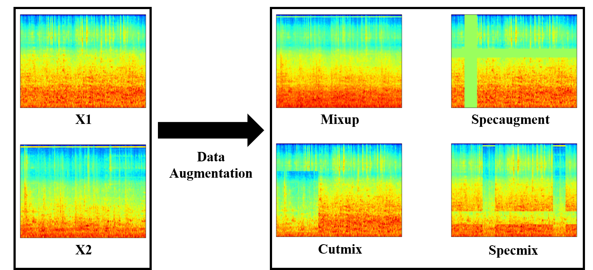
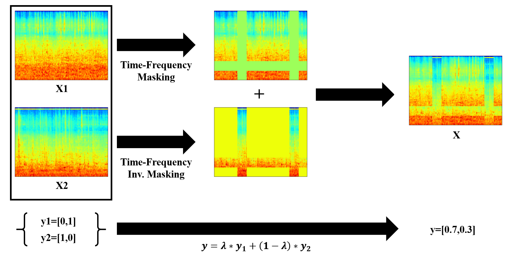

# specmix
This is a project of Interspeech2021 paper "SpecMix : A Mixed Sample Data Augmentation method for Training with Time-Frequency Domain Features"

## QuickStart

If you wanna use data augmentation method only, see util.py in the acoustic scene classification or sound event classification and use Generator classes.  
Since the Generator classes are written by numpy, you can use it to both Pytorch and Tensorflow.  
Reference of Generator class: https://github.com/yu4u/mixup-generator  

## Method

